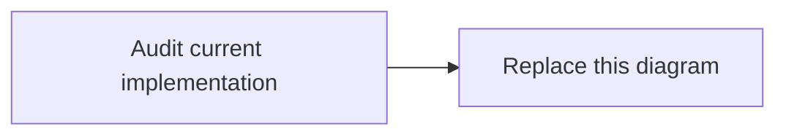

# A01 — Platform Foundation and Identity — Diagrams

## Current

## Target

Create a domain diagram aligned with the accepted specs. Label external trust boundaries,
durable records, identities, trace propagation, and failure paths where applicable.
