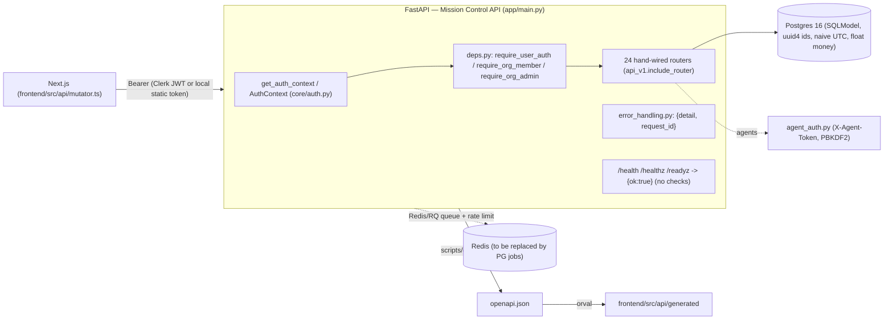
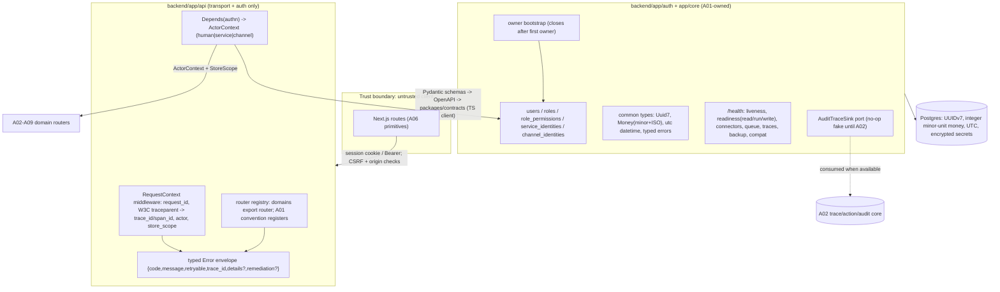

# A01 — Platform Foundation and Identity — Diagrams

## Current (audited at 3909904)

Gaps vs v2: no owner-bootstrap close, no Role/Permission/channel-identity tables, no
UUIDv7/Money/tz-aware types, no request/actor/store/trace context, no typed error codes at
runtime, health checks are stubs.

## Target

Trust boundaries: the browser is never an authorization boundary (AGENTS §7); effective
identity/scope is re-resolved server-side at request and tool-invocation time (Runtime
§6.2). Secrets stay handles/ciphertext (AGENTS I-15). Every request carries or creates a
trace context (`03-ENGINEERING.md` §6); coverage labels are `verified|observed|imported|unknown`.
