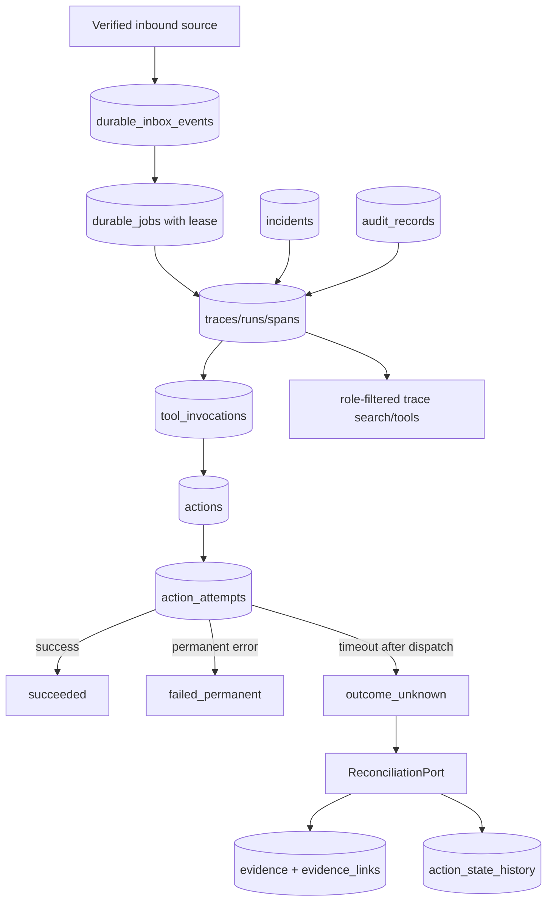

# A02 — Durable Events, Jobs, Traces, and Actions — Diagrams

## Current

```mermaid
flowchart LR
  EmailWebhook[Realtime email webhook] --> DurableInbox[durable_inbox_events]
  DurableInbox --> DurableJob[durable_jobs]
  DurableJob --> BackgroundTask[compat FastAPI background task]
  BackgroundTask --> CSLoop[Legacy CS loop]
  TraceLedger[traces/actions/evidence] --> ActivityAPI[/activity trace/action endpoints]
  BoardWebhook[Board webhook API] --> PayloadTable[board_webhook_payloads]
  PayloadTable --> DurableInbox
  DurableInbox --> DurableJob
  WorkerMode[webhook_dispatch_worker_mode legacy/durable/dual] --> DurableWorker[durable webhook worker]
  WorkerMode --> RedisQueue
  DurableJob --> DurableWorker
  DurableJob --> RedisQueue[compat Redis/RQ enqueue when new]
  DurableWorker --> DispatchWorker
  RedisQueue --> DispatchWorker[Webhook dispatch worker]
  TaskActivity[Task/comment changes] --> ActivityEvents[activity_events feed]
  RefundRequest[refund_requests] --> RefundExecutor[Direct refund executor]
```

## Target



The target keeps provider adapters outside A02. Connector owners execute provider calls
through the action attempt boundary and return typed outcomes/evidence.
