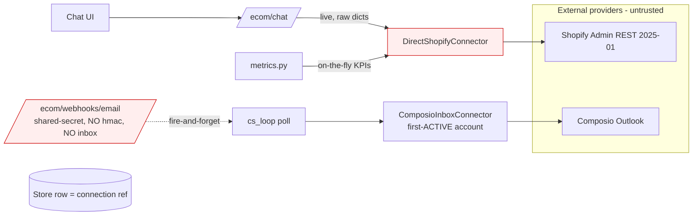
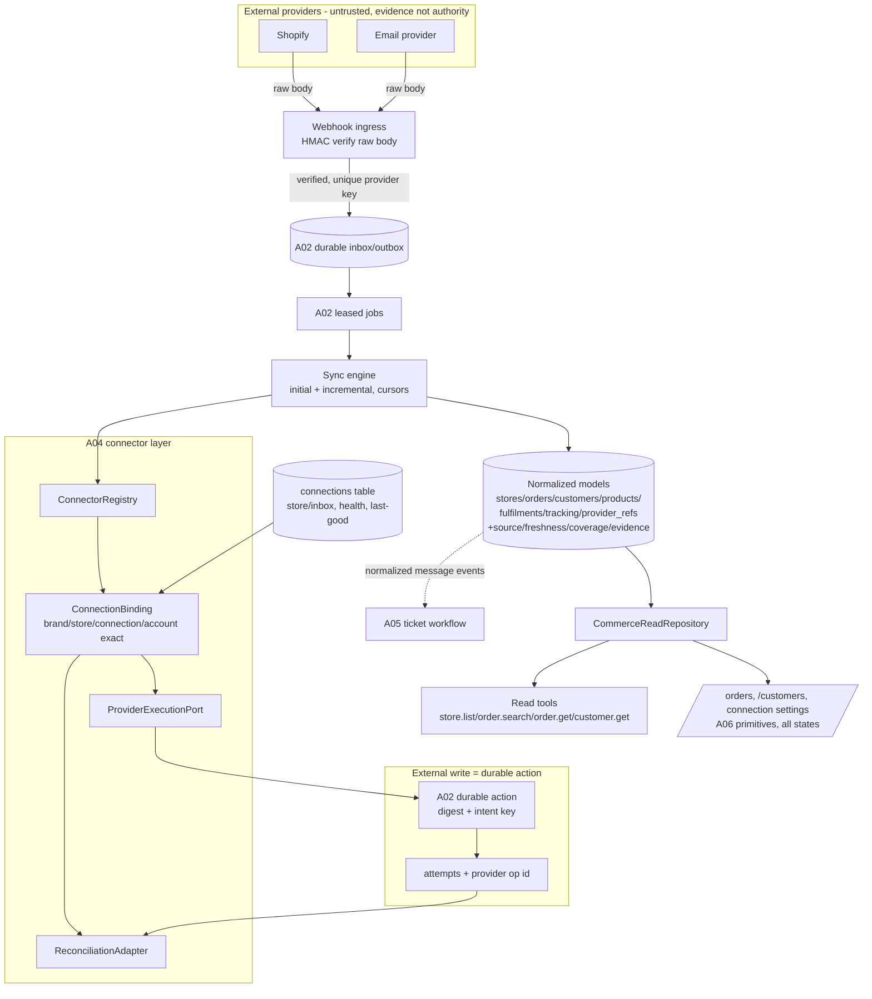

# A04 — Commerce Connectors and Read Models — Diagrams

## Current (audited at `3909904`)

No durable inbox, no normalized commerce store, no exact-account binding on inbox, no
durable action contract.

## Target (v2, aligned to specs)

Trust boundary: provider payloads stay evidence; opaque provider IDs are stored separately
and never enter public contracts. Every write is a durable A02 action with exact binding;
ambiguous timeouts become `outcome_unknown` and are reconciled before any dangerous retry.
