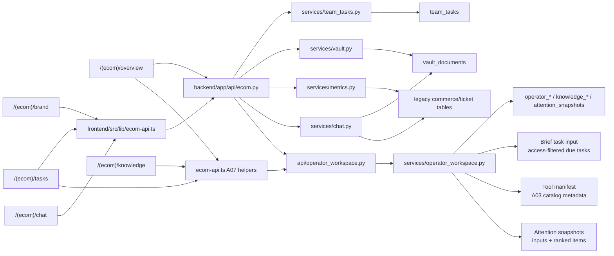
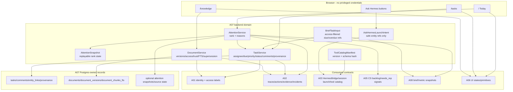

# A07 — Today, Tasks, Knowledge, and Operator Workspace — Diagrams

## Current

## Target

Failure paths:

- Missing A02/A05/A08 source: Attention item source state is `unavailable`; no zero count
  is inferred.
- Restricted document/task source: A01 access filter removes it before counts/snippets.
- Hermes unavailable or A03 contract absent: Ask Hermes action is disabled/degraded; A07
  does not open its own chat session.
- FTS extractor unavailable: document record remains with `ingestion_status` and visible
  degraded state; no vector DB is required.
