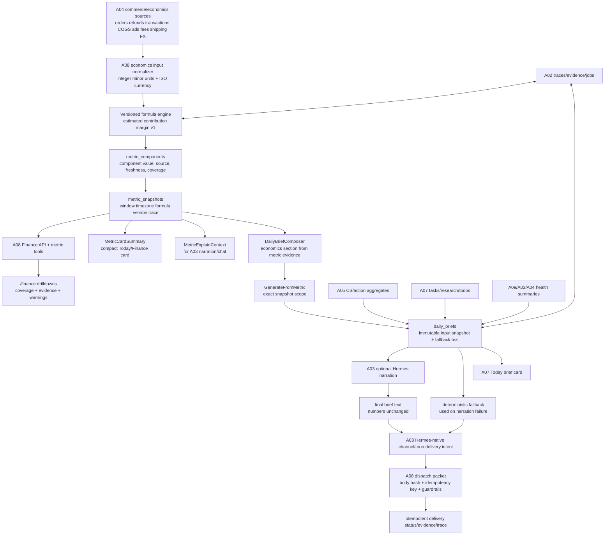

# A08 — Finance, Metric Evidence, and Daily Brief — Diagrams

## Current

```mermaid
flowchart LR
  Overview["frontend/(ecom)/overview"] --> EcomApi["frontend/src/lib/ecom-api.ts"]
  Analytics["frontend/(ecom)/analytics"] --> EcomApi
  EcomApi --> EcomMetrics["GET /api/v1/ecom/metrics"]
  EcomMetrics --> LegacyMetrics["backend/app/services/metrics.py"]
  LegacyMetrics --> StoreRows["stores connection refs"]
  LegacyMetrics --> Shopify["ShopifyConnector.list_orders"]
  Shopify --> PayloadTotals["float revenue/orders/AOV from live payloads"]

  Dashboard["frontend/app/dashboard"] --> DashboardApi["GET /api/v1/metrics/dashboard"]
  DashboardApi --> TaskAnalytics["task/approval/activity analytics"]

  Shopify --> LegacyBridge["A08 degraded legacy source bridge\npartial net_sales only"]
  LegacyBridge --> LocalFormula["A08 formula/snapshot service\nmissing inputs remain warnings"]
  LocalFormula --> MetricCard["MetricCardSummary\nA07 Today + compact Finance input"]
  LocalFormula --> BriefComposer["A08 daily brief composer\nmetric evidence -> economics section"]
  BriefComposer --> BriefGeneration["A08 generation-from-metric service\nexact scope + idempotent persist"]
  BriefGeneration --> BriefPrimitives["A08 deterministic brief primitives\nfallback body + delivery intent"]
  BriefPrimitives --> BriefExports["A08 unregistered brief API/tools\nget/generate/status/ensure"]
  BriefPrimitives --> DispatchPacket["A08 dispatch packet\nbody + idempotency key + safe-dispatch gate"]
  BriefExports --> BriefCard["BriefCardSummary\nA07 Today + Finance UI input"]
  FinanceRoute["frontend/(ecom)/finance\nsummary + exact-id drilldowns"] --> EcomApi
  FinanceRoute --> FinanceRead["A08 typed finance hooks\nexpected /api/v1/ecom/finance mount\nunmounted route degrades visibly"]
  FinanceRead -.-> BriefExports
  FinanceRead -.-> LocalFormula
  DispatchPacket --> PendingHermes["A03/Hermes delivery pending\nno transport in A08"]
  PendingHermes --> ResultCallbacks["A08 result callbacks\nnarration fallback + delivery evidence"]
  ResultCallbacks --> BriefExports
```

## Target

Trust boundaries:

- Connector payloads and external provider records are evidence, not formula authority
  until normalized with source and freshness.
- Hermes narration can prioritize and summarize only the stored deterministic snapshot;
  it never calculates or sources numbers.
- Native channel delivery remains A03/Hermes-owned; A08 records delivery intent/status
  and idempotency.
