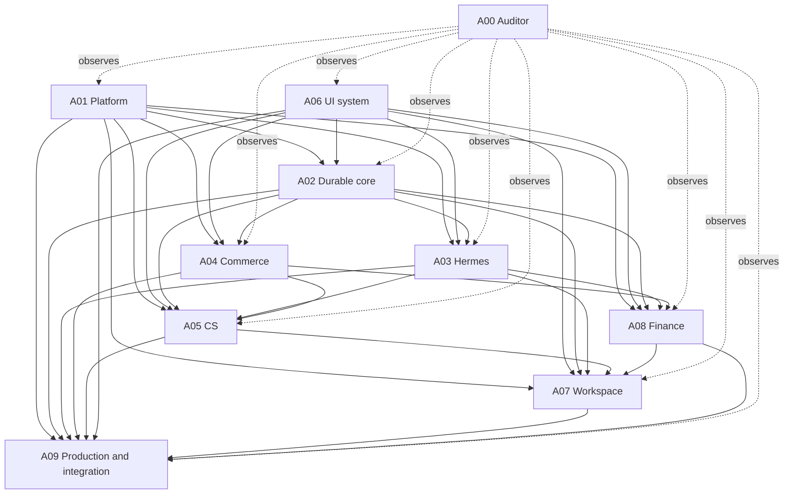

# Team Topology — Ten Agents

## Recommendation

Launch **10 agents**. This is the smallest team that keeps the load-bearing systems in
separate ownership lanes while retaining an independent auditor and an integration owner.

| ID | Role | Primary build slices | Code owner |
|---|---|---|---|
| A00 | Program auditor | All gates, no feature implementation | No — programme docs only |
| A01 | Platform foundation and identity | Slice 1 + shared contracts | Yes |
| A02 | Durable events, jobs, traces, and actions | Slices 2 and 8 | Yes |
| A03 | Hermes native integration and main chat | Slices 0, 3, channel transport in 11 | Yes |
| A04 | Commerce connectors and operational read models | Slice 4 | Yes |
| A05 | Customer service, approvals, and autonomy | Slices 5–7 | Yes |
| A06 | Design system and application shell | UI foundation for every slice | Yes |
| A07 | Today, tasks, knowledge, and operator workspace | Slices 9 and 12 | Yes |
| A08 | Finance, metric evidence, and daily brief | Slices 10 and 11 | Yes |
| A09 | Production operations, extensions, integration, and quality | Slice 13 + release gates | Yes |

## Dependency graph

Dependencies do not mean downstream agents wait idly. They start by auditing the current
implementation, defining their contracts, building fixtures and isolated domain logic,
and recording exact interface requests. They merge only when the required upstream
contract is available.

## Why not fewer

- Combining A02 and A05 makes the action ledger subordinate to one workflow instead of a
  platform primitive.
- Combining A03 and A05 recreates a Hermes wrapper rather than a peer integration.
- Combining A04 and A08 confuses connector normalization with financial definitions.
- Combining A06 with product-page work makes every UI branch edit the same tokens, shell,
  and primitives.
- Combining A00 and A09 removes independent review: the same agent would judge its own
  integration work.

## Why not more

The remaining boundaries are tightly coupled enough that extra agents would split a
single data model or route family and create more merge conflicts than throughput.
